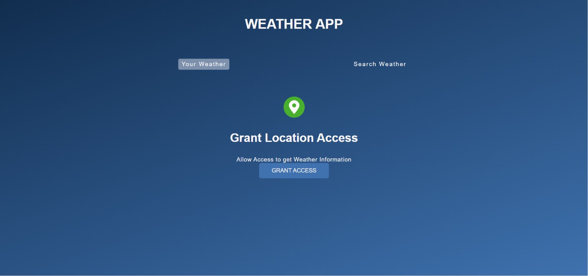
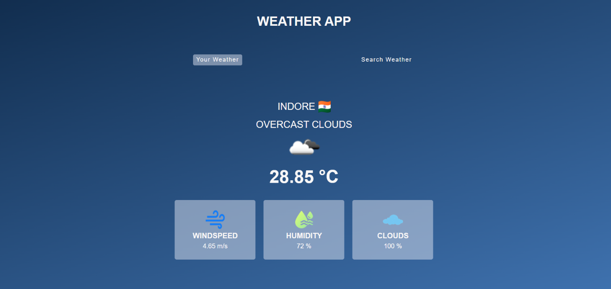
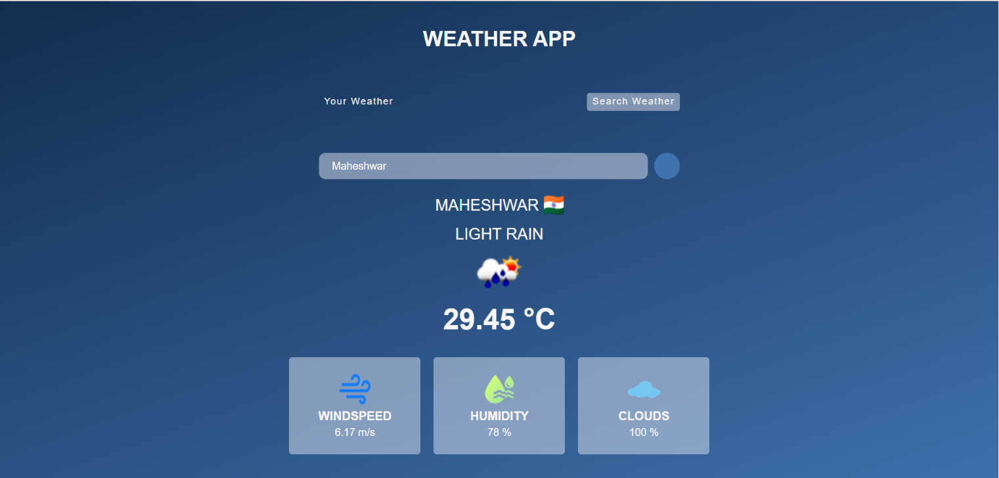
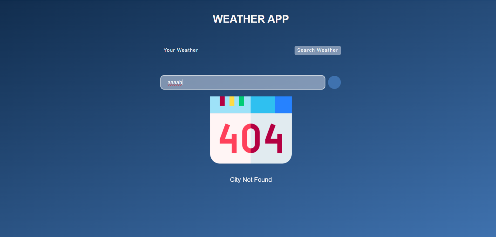

# 🌦️ Weather App

A simple and responsive Weather App built using HTML, CSS, and JavaScript. This application uses the OpenWeather API to display real-time weather information for the user's current location or any searched city.

## 🚀 Live Demo

https://yadavsawan4062-hub.github.io/WeatherApp/

## 📸 Screenshots

### 🏠 Home Page



### 📍 Current Location Weather



### 🌍 Search Weather by City



### ❌ City Not Found



## ✨ Features

* Get weather using your current location
* Search weather by city name
* Display current temperature
* Show weather conditions
* Display humidity
* Display wind speed
* Responsive User Interface
* Real-time Weather Data using OpenWeather API

## 🛠️ Technologies Used

* HTML5
* CSS3
* JavaScript
* OpenWeather API

## 📂 Project Structure

```text
WeatherApp/
│
├── index.html
├── style.css
├── script.js
└── assets/
```

## 💻 How to Run

1. Clone the repository

```bash
git clone https://github.com/yadavsawan4062-hub/WeatherApp.git
```

2. Open the project folder

```bash
cd WeatherApp
```

3. Open `index.html` in your browser

> **Note:** Add your OpenWeather API key in the JavaScript file before running the project if required.

## 👨‍💻 Author

**Sawan Yadav**

GitHub: https://github.com/yadavsawan4062-hub
